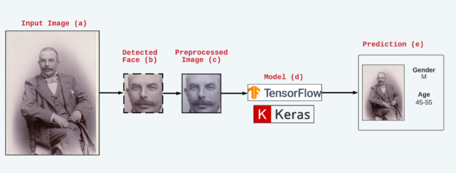
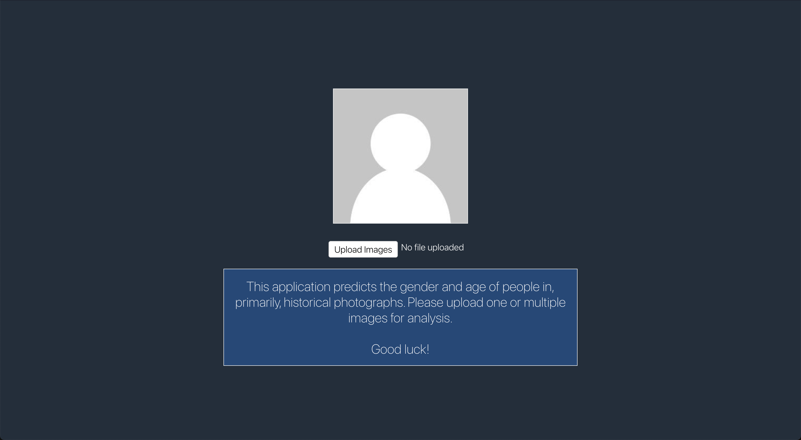

# Faces  

Source code for the 2021 Bachelor's project [Classifying Age and Gender on Historical Photographs using Convolutional Neural Networks](http://uu.diva-portal.org/smash/record.jsf?pid=diva2%3A1567315&dswid=-6609) at Uppsala University.

# Navigating the repository 
 - <em>assets/</em> - Images for the README
 - <em>data/</em> - The labels used to train the models
 - <em>model_training/</em> - Scripts and tools for training new models
 - <em>tools/</em> - Scripts for preprocessing a large number of images before training
 - <em>web/</em> - Everything related to the user interface 

# Installing Python dependencies 
    python -m pip install -r requirements.txt

# Web Interface

## The React App
**From web/**

    npm install
    npm start

Note: Defaults to port 3000

## Server - Needed for the face detection
**From web/server/**

    npm install
    node server.js

Note: Defaults to port 4000

**Ready to run!**

# Contributors
- [Gabriel Lindgren (gali8033)](https://github.com/gali8033)
- [Filip Pagliaro (FilPag)](https://github.com/FilPag)
- [Liv Cederin (Livcederin)](https://github.com/Livcederin)
- [Ulrika Bremberg (ulrikabremberg)](https://github.com/ulrikabremberg)

Because pair programming was used during the project, commits usually have more authors than the said contributor.
